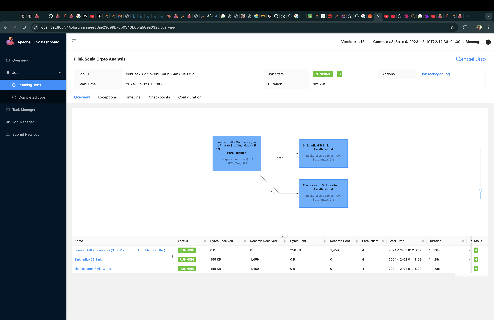
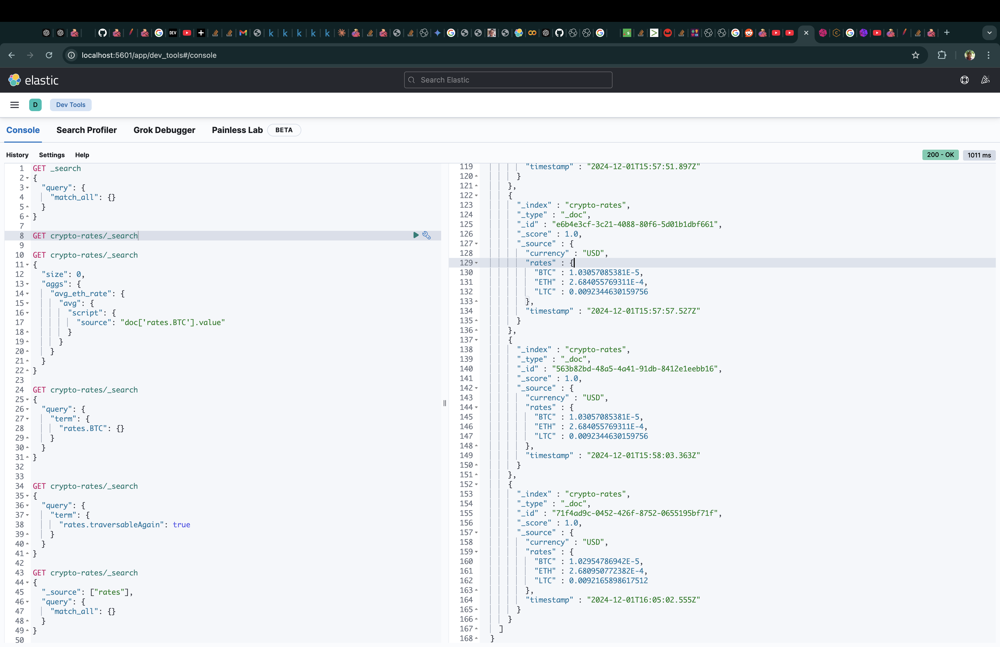
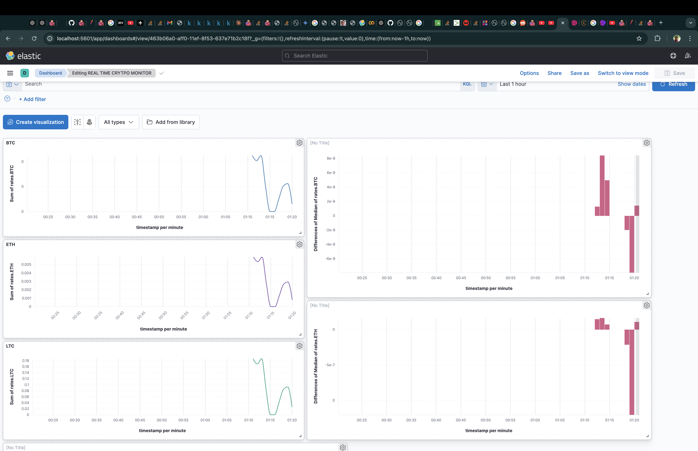
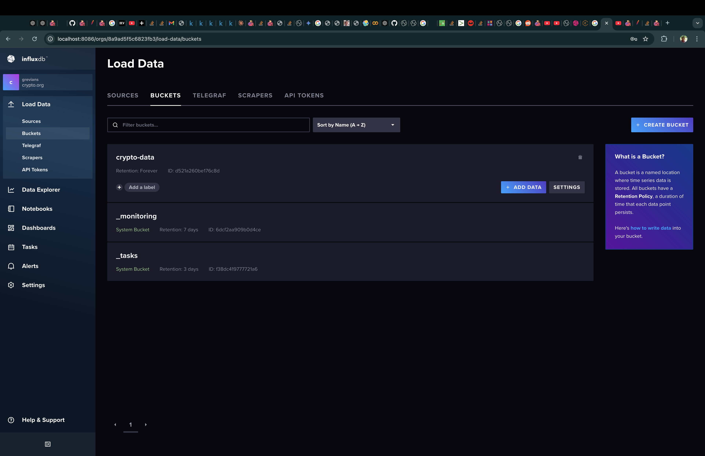

# Crypto Pipeline Project

This project tracks cryptocurrency price trends and analyzes live trading activity in real time. The pipeline ingests data, processes it, and stores the results for visualization and analysis.

---

## Pipeline Overview
- **Data Ingestion**: Kafka streams real-time cryptocurrency data.
- **Data Processing**: Flink processes the data for aggregation and transformation.
- **Data Storage**: 
  - PostgreSQL for structured data.
  - Elasticsearch for advanced search and analytics.
- **Visualization**: Kibana displays interactive dashboards for insights.

---

## Architecture Diagram

## Flink Job

## Kibana Dev

## Kibana Dashboard

## influxDB

